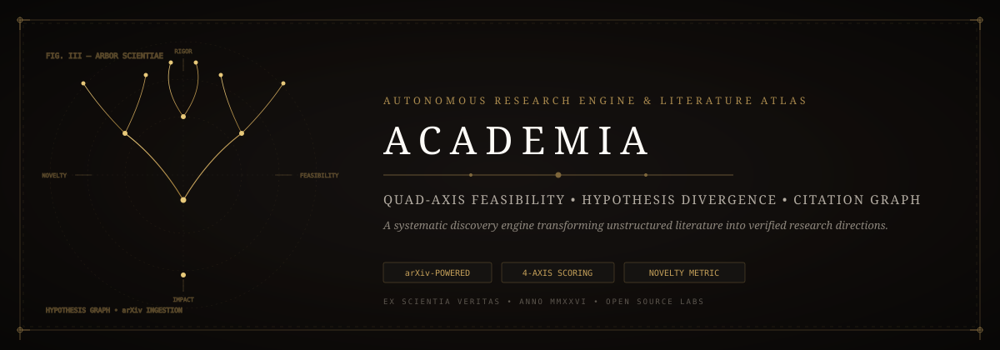
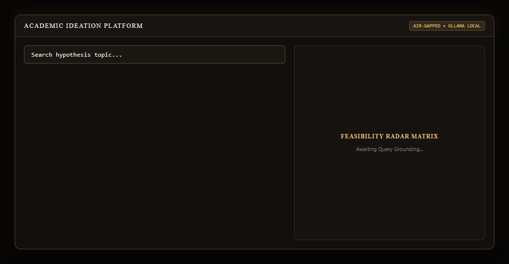
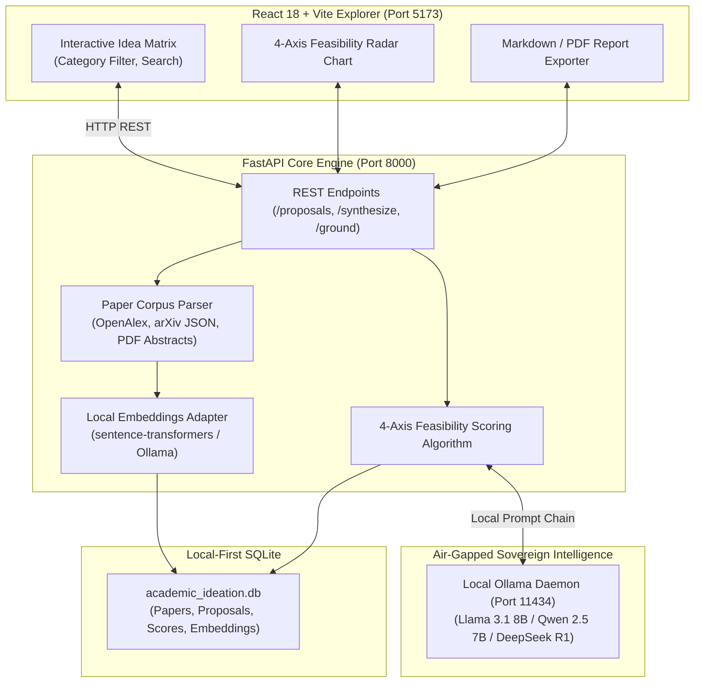
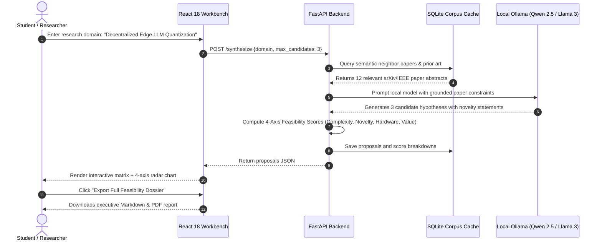

<p align="center">
  
</p>

# 🎓 Academic Ideation Platform — Air-Gapped Research Grounding & Feasibility Engine

[](https://github.com/Jaswanth1902/-Academic-ideation-platform)
[](https://github.com/Jaswanth1902/-Academic-ideation-platform)
[](https://github.com/Jaswanth1902/-Academic-ideation-platform)
[](LICENSE)
[](SECURITY.md)

<p align="center">
  
</p>

An end-to-end, self-hosted **Academic Research & Project Ideation Engine**. Combines a reactive TypeScript/Tailwind exploration workbench with an autonomous Python backend that cross-references research hypotheses against academic paper corpuses, computes multi-dimensional feasibility scores, and generates rigorous problem statements using local LLM inference.

---

## 🏗️ Architecture & Processing Pipeline



---

## 🔄 Research Ingestion & Feasibility Sequence



---

## 💡 Why I Built This

As a student and learner who owes everything to open source, I know how overwhelming and expensive it can be to brainstorm project ideas or research proposals when you're forced to pay for cloud API tokens, or spend weeks reading hundreds of PDFs just to find out if an idea is feasible.

I built this platform to improve Quality of Life (QOL) for fellow students, researchers, and independent builders:
- **100% Free & Local**: Uses local Ollama or vLLM models — no API keys, no subscription paywalls, and complete data privacy.
- **Grounded in Real Literature**: Cross-references verified papers so ideas are anchored in reality, not AI hallucinations.
- **Honest Feasibility Scoring**: Evaluates hardware constraints, dataset availability, and technical complexity before you write a single line of code.

My goal is to empower other learners to explore creative research and build impactful open-source tools with confidence!

---

## ⚡ Core Capabilities

- **Corpus-Grounded Idea Synthesis**: Ingests arXiv, IEEE, and custom academic paper datasets to ground student and lab proposals in verified literature.
- **Multi-Factor Feasibility Scoring**: Evaluates candidate projects across:
  - *Technical Complexity* (algorithmic depth, compute requirements)
  - *Novelty Index* (distance from published prior art)
  - *Implementation Feasibility* (dataset availability, hardware constraints)
  - *Academic Value* (impact potential and publication viability)
- **Zero-Cloud Air-Gapped Inference**: Runs natively against local **Ollama** or **vLLM** endpoints with automatic prompt formatting and JSON schema validation.
- **Interactive Matrix Explorer**: High-density React dashboard with category filtering, real-time search, and instant PDF/Markdown report export.

---

## 🧩 Skills & Plugins Ecosystem

- **`research` Skill**: Continuously scrapes academic preprints to seed the local database.
- **`notebooklm-bridge`**: Ingests synthesized research dossiers directly into NotebookLM for audio discussions.
- **`report-generator`**: Compiles proposals into publication-ready IEEE/ACM Word and LaTeX formats.
- **`academic-openalex` (Roadmap)**: Live API connector streaming citation velocity.

---

## 🛡️ Security Hardening & Air-Gapped Privacy

- **100% Air-Gapped**: Hardcoded to bind to `127.0.0.1`. Never leaks unpublished thesis proposals or private lab drafts across the public cloud.
- **PDF Sanitization**: Strips dangerous executable JavaScript and active macros from uploaded research PDFs.
- **Prompt Injection Boundary**: Wraps untrusted abstracts inside rigid XML/JSON delimiters to stop adversarial research papers from overriding evaluation rubrics.

---

## 🚀 Quickstart

### Prerequisites
- Python 3.10+
- Node.js 18+ (for frontend development)
- [Ollama](https://ollama.ai/) installed and running locally (`ollama run llama3.1:8b` or `qwen2.5:7b`)

### 1. Launch Backend
```bash
cd backend
python -m venv venv
source venv/bin/activate  # On Windows: .\venv\Scripts\activate
pip install -r requirements.txt
python launch.py
```

### 2. Launch Frontend Explorer
```bash
cd ../frontend
npm install
npm run dev
```
Open [http://localhost:5173](http://localhost:5173) in your browser.

---

## 🏷️ GitHub Topics & Keywords
`research` • `academic-ideation` • `arxiv` • `ollama` • `vllm` • `local-llm` • `react18` • `vite` • `fastapi` • `sqlite` • `rag` • `literature-review` • `offline-ai` • `self-hosted` • `openalex`

---

## 📄 License
Distributed under the [MIT License](LICENSE). Copyright (c) 2026 Jaswanth Reddy.
